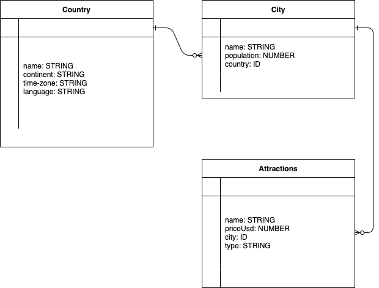

# WanderLost
**Introduction** For this Unit 2 Project, a Full Stack app will be created, where the user can view and add different attractions from different cities in different countries to plan their trips in the future!

## ERD

## Wireframe

## User Stories

* User will be able to search al cities with attractions

* User will be able to log an attraction to a city that they have visited

* User will see all attractions in a specific city, by lowest to highest price.

## Technologies
**Front-End**
* HTML
* CSS
* JavaScript

**Back-End**
* Node.JS
* Express
* MongoDB
* Mongoose